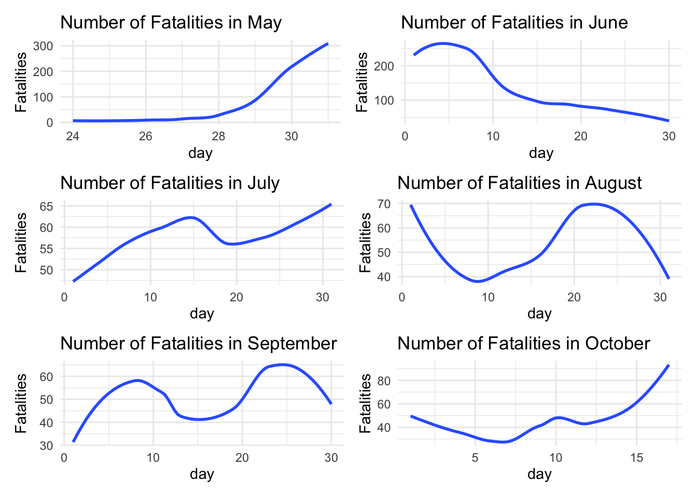

Animated Scatter showing average number fatalities over the months by event type:


```r
##this needs to be changed

anim_data =
  protest_data %>% 
  group_by(month, event_type) %>% 
  filter(event_type != "Battles") %>% 
  summarize(
    max_death = max(fatalities)
  )

anim_plot =
  anim_data %>% 
  group_by(month) %>% 
  ggplot(aes(x = month, y = max_death, color = event_type)) +
  geom_line() +
  geom_point() +
  labs(title = "Number of Fatalities over Time by Event Type",
       x = "Month",
       y = "Max Number of Fatalities") +
  transition_reveal(month)

animate(anim_plot, renderer = gifski_renderer())
```


2 bar charts showing the number of each event type compared to the number of each sub event type:


```r
bar_type =
  protest_data %>% 
  group_by(event_type) %>% 
  count() %>% 
  ggplot(aes(x = event_type, y = n, fill = event_type)) +
  geom_col() +
  geom_text(aes(x = event_type, y = n, label = n), position = position_dodge(width = 0.9), vjust = -0.25) +
  theme(axis.text.x = element_text(angle = 90),
        legend.position = "right")

bar_subtype =
  protest_data %>% 
  group_by(sub_event_type) %>% 
  count() %>% 
  ggplot(aes(x = sub_event_type, y = n, fill = sub_event_type)) +
  geom_col() +
  geom_text(aes(x = sub_event_type, y = n, label = n), position = position_dodge(width = 0.9), vjust = -0.25) +
  theme(axis.text.x = element_text(angle = 90),
        legend.position = "right")

bar_type / bar_subtype
```


Scatter plots comparing fatalities each day over the course of each month:


```r
may =
  protest_data %>% 
  filter(month == 5) %>% 
  group_by(day) %>% 
  count(fatalities) %>% 
  ggplot(aes(x = day, y = n)) +
  geom_smooth(se = FALSE) +
  labs(title = "Number of Fatalities in May",
       y = "Fatalities")

june =
  protest_data %>% 
  filter(month == 6) %>% 
  group_by(day) %>% 
  count(fatalities) %>% 
  ggplot(aes(x = day, y = n)) +
  geom_smooth(se = FALSE) +
  labs(title = "Number of Fatalities in June",
       y = "Fatalities")

july = 
  protest_data %>% 
  filter(month == 7) %>% 
  group_by(day) %>% 
  count(fatalities) %>% 
  ggplot(aes(x = day, y = n)) +
  geom_smooth(se = FALSE) +
  labs(title = "Number of Fatalities in July",
       y = "Fatalities")

august =
  protest_data %>% 
  filter(month == 8) %>% 
  group_by(day) %>% 
  count(fatalities) %>% 
  ggplot(aes(x = day, y = n)) +
  geom_smooth(se = FALSE) +
  labs(title = "Number of Fatalities in August",
       y = "Fatalities")

sept =
  protest_data %>% 
  filter(month == 9) %>% 
  group_by(day) %>% 
  count(fatalities) %>% 
  ggplot(aes(x = day, y = n)) +
  geom_smooth(se = FALSE) +
  labs(title = "Number of Fatalities in September",
       y = "Fatalities")

oct = 
  protest_data %>% 
  filter(month == 10) %>% 
  group_by(day) %>% 
  count(fatalities) %>% 
  ggplot(aes(x = day, y = n)) +
  geom_smooth(se = FALSE) +
  labs(title = "Number of Fatalities in October",
       y = "Fatalities")

(may + june) / (july + august) / (sept + oct)
```



