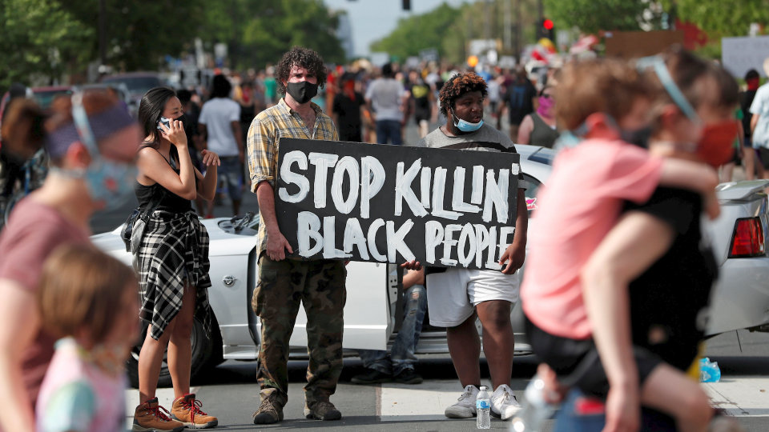

&nbsp;

 Image source: [Wall Street Journal](wsj.com)

&nbsp;

# About the Project
This project is motivated by the killing of George Floyd and the protests that followed in the United States. This project will look broadly at police violence in the United States through analysis of data on individuals killed at the hands of police from 2013 to 2020, and will also focus specifically on the Black Lives Matter protests that have occurred in 2020. This project is ultimately being completed to assess the instances of excessive use of force by police and to determine whether instances of excessive force are concentrated demographically and geographically.

&nbsp;

# Website Overview
Data for this project was acquired from the Mapping Police Violence group for data on police violence in the United States, the ACLED US Crisis Monitor for data on 2020 Black Lives Matter protests in the United States, and the American Community Survey for data on income.

In the Exploratory Analysis tab, you will find:
<ul>
<li>analyses of mapping police violence data, through visualizations</li>
<li>analyses of protest data, through visualizations</li>
<li>ACS visualizations combined with the protest and police violence data</li>
</ul>

In the Regression Analysis tab, you will find:
<ul>
<li> </li>
<li> </li>
</ul>

The interactive maps tab will lead you to a dashboard including interactive maps and plots that will change depending on your selection.

&nbsp;

# For More Information...
1. Visit the [Project Report](proj_report.html) tab in the upper right of the website for a full page on what was done from start to finish in this project.
 and
2. Visit our project Youtube video, linked in the upper right corner of the website, for a brief introduction and overview of the project.

&nbsp;

Collaborators:
<ul>
<li>Rebekah Hughes</li>
<li>Megan Marziali</li>
<li>Leighanne Wang</li>
<li>Jinghan Zhang</li>
<li>Adam Rosenfeld</li>
</ul>