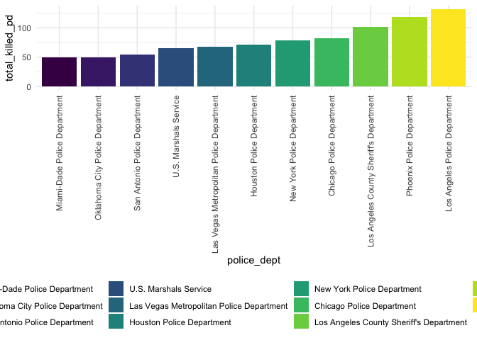
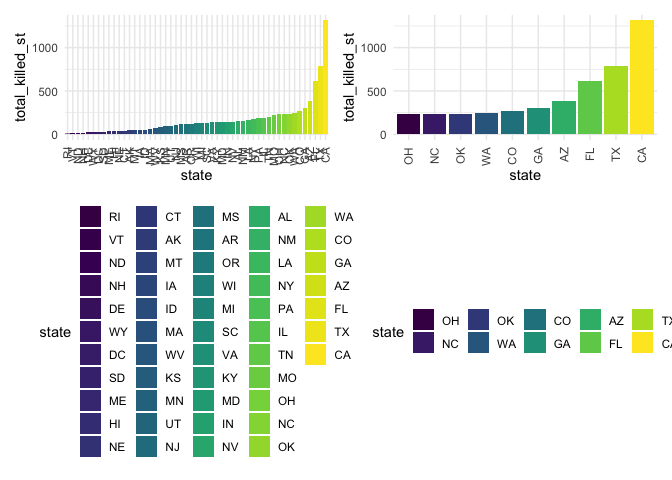
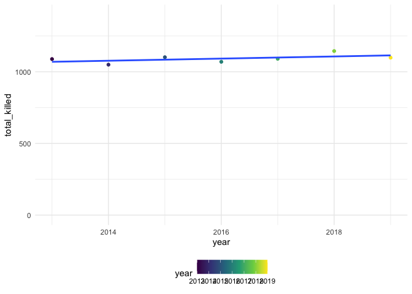

Plotting for MPV
================

## MPV Dataset

``` r
mpv_df =
  read_excel("./data/MPVDatasetDownload.xlsx",
             sheet = "2013-2020 Police Killings") %>%
  janitor::clean_names() %>% 
  separate(date_of_incident_month_day_year, c("year", "month", "day")) %>% 
  mutate(
    age = as.numeric(victims_age),
    gender  = victims_gender,
    race = victims_race,
    police_dept = agency_responsible_for_death,
    description = a_brief_description_of_the_circumstances_surrounding_the_death,
    disposition = official_disposition_of_death_justified_or_other,
    year = as.numeric(year),
    month = as.numeric(month),
    day = as.numeric(day)) %>%
  select(
    age, gender, race, police_dept, description, disposition, year,
    month, day, city, state, county, cause_of_death, criminal_charges,
    symptoms_of_mental_illness)

write_csv(mpv_df, "./data/mpv_tidy.csv")
```

The plot below visualizes the total number of people killed by police,
arranged by police department.

``` r
police_dept_plot = 
  mpv_df %>% 
  count(police_dept) %>% 
  rename(total_killed_pd = n) %>% 
  filter(total_killed_pd >= 49) %>% 
  mutate(
    police_dept = factor(police_dept),
    police_dept = fct_reorder(police_dept, total_killed_pd)
  ) %>% 
  ggplot(aes(x = police_dept, y = total_killed_pd, fill = police_dept)) +
  geom_col() +
  theme(axis.text.x = element_text(angle = 90, vjust = 0.5, hjust = 1))

police_dept_plot
```



The plots below visualize police killings by state. One includes all
states with data, the other includes the top 10 states.

``` r
state_plot = 
  mpv_df %>% 
  count(state) %>% 
  rename(total_killed_st = n) %>% 
  arrange(desc(total_killed_st)) %>% 
  mutate(
    state = factor(state),
    state = fct_reorder(state, total_killed_st)
  ) %>% 
  ggplot(aes(x = state, y = total_killed_st, fill = state)) +
  geom_col() +
  theme(axis.text.x = element_text(angle = 90, vjust = 0.5, hjust = 1))

state_subset_plot = 
  mpv_df %>% 
  count(state) %>% 
  rename(total_killed_st = n) %>% 
  arrange(desc(total_killed_st)) %>% 
  filter(total_killed_st >= 230) %>% 
  mutate(
    state = factor(state),
    state = fct_reorder(state, total_killed_st)
  ) %>% 
  ggplot(aes(x = state, y = total_killed_st, fill = state)) +
  geom_col() +
  theme(axis.text.x = element_text(angle = 90, vjust = 0.5, hjust = 1))

state_plot + state_subset_plot
```



The plot below shows police killings over time until 2019 (I excluded
2020, because otherwise it looks like 2020 has a drop in police
killings).

``` r
year_plot = 
  mpv_df %>% 
  count(year) %>% 
  rename(total_killed = n) %>% 
  filter(year < 2020) %>% 
  ggplot(aes(x = year, y = total_killed, color = year)) + geom_point() + geom_smooth(method = lm, se = FALSE) +
  scale_y_continuous(limit = c(0, 1400))

year_plot
```

    ## `geom_smooth()` using formula 'y ~ x'


